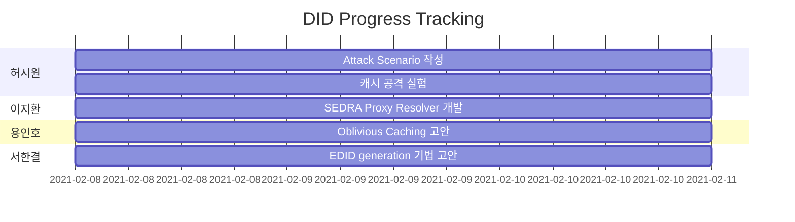
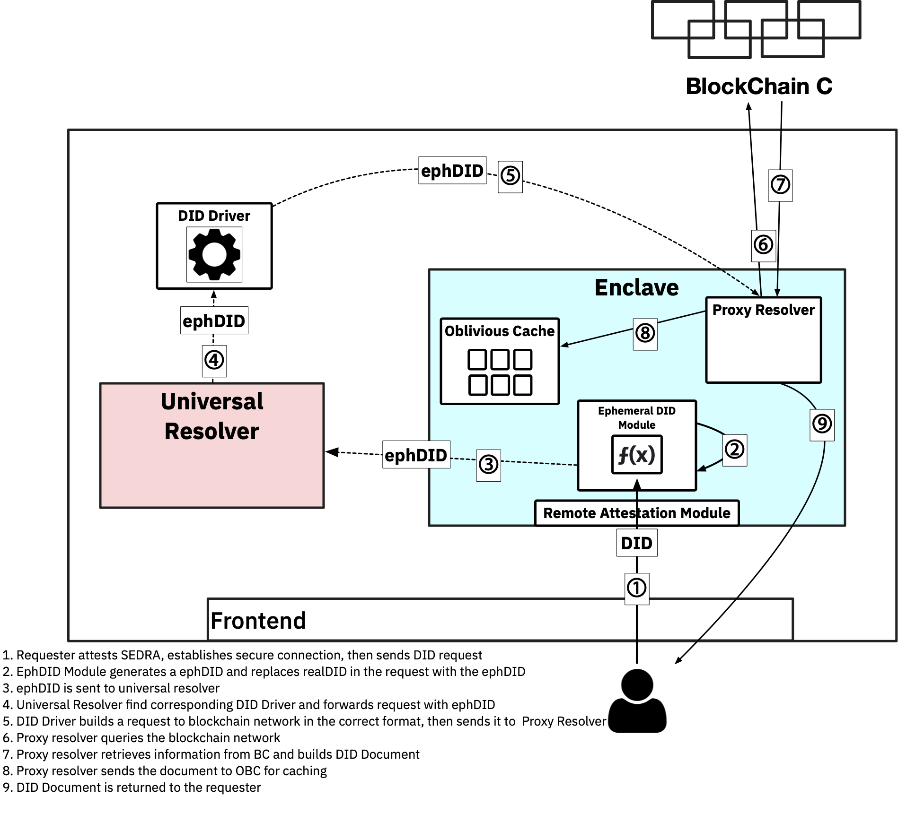

# DID Progress Tracking


# DID Security Analysis

# SEDRA(Prototype)


## Universal Resolver
This is the way you can deploy universal Resolver on sslab.    
access to sslab    
$ virt-manager    
run DID virtual machine (ID, PW same as sslab id)    
$ git clone http://github.com/decentralized-identity/universal-resolver    
$ cd universal-resolver    
$ docker-compose -f docker-compose.yml pull    
$ docker-compose -f docker-compose.yml up    

Send Key - Ctrl+Alt+F2 to turn virtual terminal    
try to send DID request using curl; these are examples.    
curl -X GET http://localhost:8080/1.0/identifiers/did:sov:WRfXPg8dantKVubE3HX8pw    
curl -X GET http://localhost:8080/1.0/identifiers/did:v1:test:nym:z6Mkmpe2DyE4NsDiAb58d75hpi1BjqbH6wYMschUkjWDEEuR    
curl -X GET http://localhost:8080/1.0/identifiers/did:key:z6Mkfriq1MqLBoPWecGoDLjguo1sB9brj6wT3qZ5BxkKpuP6    
curl -X GET http://localhost:8080/1.0/identifiers/did:ethr:mainnet:0x3b0BC51Ab9De1e5B7B6E34E5b960285805C41736    
curl -X GET http://localhost:8080/1.0/identifiers/did:ethr:0x02b97c30de767f084ce3080168ee293053ba33b235d7116a3263d29f1450936b71    
curl -X GET http://localhost:8080/1.0/identifiers/did:nacl:Md8JiMIwsapml_FtQ2ngnGftNP5UmVCAUuhnLyAsPxI    

## DID Attack Models

### Side Channel Information leak
The combination of the lack of proper DID request authentication and DID document caching, may allow extraction of unintended information through side-channels. The current prototype of the universal resolver uses a rather simple caching scheme (e.g., the default caching package from Node.js). This means that cache miss and cache hit shows discernable time difference, and we could find it through sending request and analyze the time difference for multiple times. You can see it by running cache.py in the repository.    

Default DID resolver ('did-resolver') uses a simple Map to enable the built in Cache for the DID Resolver object     
For example,      
const resolver = new DIDResolver({    
    ethr,    
    web    
}, true).    

You can see how the "built in Cache" works in the code of 'did-resolver' here:    
https://github.com/decentralized-identity/did-resolver/blob/1631fa91cac0888c039c84a543855193081273e3/src/resolver.ts      
It marks document 'no-cache' as default,  returns document immediately if cached and resolves newly if not.     

As you can see, there was no automatic TTL or other settings set that can mitigate side channel attacks.      
I could easily find some services that uses did-resolver with default setting(cf. OpenAttestation, Notabene, Ceramic).     
If those services are location-sensitive, the service could leak users' information or privacy.     


* DIF says it is able to bring other caching packages (cf. js-cache), but it says they are **not tested**. (Also packages like 'js-cache' does not even solve the timing attack problem)     
* There were also some resolvers who do not use caching; cf. 'ethr-did-resolver' based services or services with built-in-Cache turned-off.    
* They had quite low resolving performance compared to the other methods; 2s per one request.     

Suggestion:    
We suggest that the caching should be used not to reduce the retrieval time but only for the computing performance.    
So the retrieval time should be random(in a certain range) or constant.


## DID Universal Resolver Driver

### Mechanism of Universal Resolver Driver
Universal resolver driver is a intermediary between universal resolver and blockchain network. Each blockchain networks have different structures and API, universal resolver driver is needed for each kind of methods.
Simply put, the main role of driver is verification request for received DID information. Javascript is used to make most of them, especially NodeJS (some of them use Java). In other words, these are worked on NodeJS. These drivers mainly use ExpressJS to communicate with universal resolver, which listen on designated port. Drivers accept this HTTP request with respect to URI which matches specific regular expression. After acception, driver extract DID id, method, and identifier. After that, send verification requests to corresponding blockchain.
When drivers receive verification results from blockchain network, most of them receive results as a form of JSON. After receiving, most of them send back to requester, but some of them resolve JSON information on them and save it.


## Caching
- DIF's DID universal resolver is implemented with Maven (Java). **We need to investigate further to check if there are any caching is used in this implementation**
- DIF's javascript implementation of resolver (https://github.com/decentralized-identity/did-resolver) uses ```js-cache``` this can render the resolver vulnerable to cache timing attacks
- Achieving faster response time is not a top priority goal for resolvers. Hence, we can consider applying uniform response time caching or simply remove caching.


## DID Driver structure
- DID drivers can be added to the universal resolver by submitting pull requests to https://github.com/decentralized-identity/universal-resolver
- While an API (```Swagger API```) is provided for device driver development, there is no strict restriction on the implementation of the drivers. For instance, Soverign driver is written as a Java-based web service while uport is a pure javascript program. 
- Each driver is required to run as a docker container that exposes a http daemon through port ```8080``` 
- The universal resolver invokes drivers by sending ```HTTP GET``` to the driver container
- Drivers are registered to the universal resolver in ```config.json``` and ```docker-compose.yml``` of UR   
